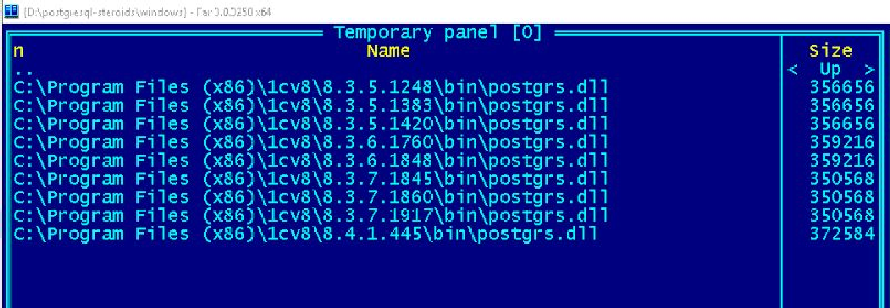
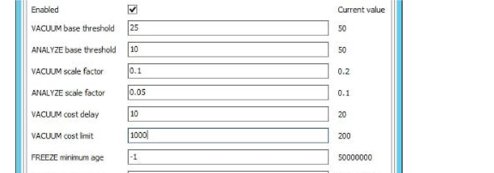

**Полезны ли такие технологии системному администратору с небольшим количеством
сотрудников ?**

Конечно, любому системному администратору будет полезно расширить кругозор
технологий, вне зависимости от количества сотрудников, с которыми приходятся
работать. Сегодня это до 30 человек, завтра уже более 300. К сожалению, или к
счастью, PostgreSQL и под linux и под Windows не представляет собой монолитное
ядро, и всегда содержит включенные расширения и специальные утилиты для
владения.

**Q2: Преимущества / недостатки использования PostgreSQL по сравнению с MSSQL
EXPRESS для небольшой фирмы?**

По некоторым операциям, в частности проведение документов и формирование
отчетов, PostgreSQL вообще будет быстрей, чем MSSQL Express. Одновременно с
этим, функциональность MSSQL Express, в части сжатия и в части флагов тонкой
настройки, отсутствует в бесплатной версии, что в итоге все равно приводит к
администрированию СУБД, примерно на таком же уровне что и PostgreSQL.

>   **Q3: “Летает” PostgreSQL значительно ниже, чем MS SQL через SharedMemory**

Это несколько голословное утверждение, хотя и имеющее право на жизнь. В рамках
вебинара, да и в принципе, мы должны сказать, что в составе платформы
используются postgrs.dll и libpq.dll, и очень много зависит от их версий. То
есть фактически не от способа соединения с СУБД (TCP/IP, NamedPipe,
SharedMemory), а от оптимальности строящихся запросов и от оптимальности работы
самой библиотеки доступа к PostgreSQL. “MSSQL в режиме SharedMemory” обычно
устанавливают на одном компьютере для снижения количества трудозатрат на
настройку сервера 1С и СУБД, вследствие чего начинают тратить денежные средства
уже на закупку оборудования, чтобы оставить архитектурное решение в старом
формате.

>   **Q4: Репликация сторонними утилитами отдельных баз данных**

PostgreSQL из коробки позволяет настраивать Stream Replication, т.е.
реплицироваться будет весь instance ​со всеми базами данных внутри него.
Репликация отдельных БД тоже поддерживается, но строится за счет отдельных
утилит, таких как burardo (живой проект, написанный на perl), Longdiste3 (живой
проект, написанный на python). Отдельно стоит заметить, что Streaming
Replication ­ это полноценная функция PostgreSQL 9.5.2, сборки которой вышли
через несколько дней после нашего вебинара.

Longdiste *​https://github.com/markokr/skytools* ­ это часть так называемых
SkyTools.​

>   **Q5: Рекомендации по железу. Особенно в части диска. И разделять ли сервер
>   1С и PostgreSQL.**

>   Что касается дисковой подсистемы:

-   если проект высоко­нагруженный, то в качестве back­and, под саму базу
    данных, а также отдельный диск под журналы, необходимо использовать SSD;

-   не стоит экономить на RAID контроллерах. Если не получается, то тогда лучше
    использовать software RAID;

-   RAID 1+0 ­ если вы знаете что это такое;

-   если SSD использовать возможности нет, то разнесение на разные диски, а
    также на разные storage будет уже неплохо;

-   На файловой системе (xfs или ext4) выставить значение параметра barrier=0,
    noatime (если Linux). В Windows вы такого не получите. Отдельно btrfs или
    zfs ­ в зависимости от компетенции Вашего системного администратора;

-   SWAP выставить в 0 ­ отдельная история, чтобы сервер PG работал именно с
    памятью, а не с файлом подкачки, как с памятью. Если это не сделать, системы
    мониторинга будут показывать неверные данные по использованию памяти.

>   По поводу выделение отдельных серверов, все зависит от конкретных случаев.
>   Какие­либо явные рекомендации сложно дать. Есть за и против. Например, мы
>   считаем что необходимо разносить, чтобы оптимально взглянуть на свою
>   инфраструктуру. “Ленивые” администраторы обычно любят поступать по другому,
>   устанавливать все на один сервер, настроить один раз “руками” и забыть про
>   сервер на долгие годы.

Наша рекомендация достаточно простая ­ 1С сервер на Windows, PostgreSQL на
Linux. На разных серверах ­ наиболее оптимальная связка с точки зрения
производительности, повышения компетенции администратор​а​ **и стабильности.**

После и во время вебинара 
==========================

>   **Q6: Garther и как его читать ?**

>   Согласно данным Garther при расчете ROI нужно выделить 4 показателя:

-   **GTM (Объекты 1С)** ­ сколько метаданных верхнего уровня существует в Вашей
    конфигурации. В терминах Gartner ­ это называется опция, и мы можем
    рассчитать её доходность.

-   **GQL (Конфигурация 1С)** ​­ сколько у вас конфигураций 1С. Обратите
    внимание, что существуют константы:

>   ○ Количество ошибок в среднем в журналах регистрации, связанных с СУБД, в
>   том числе и из технологического журнала 1С.

○ А также мы знаем, среднее время затрат на исправление проблемы СУБД.

-   **GHC (Команда 1С) ­** ​команда проекта 1С, включая системного
    администратора.

-   **GFX (Пользователи 1С) ­** активные пользователи Вашей системы.​

Управляя сроком жизни проекта (в общем случае мы устанавливаем 12 месяцев) и
зарплатой программистов, которую мы можем рассчитать, а также количеством
человек в команде, мы можем предварительно понять количество свободных денежных
средств, которые мы можем направить на обучение наших специалистов или вывести
на другие ИТ проекты.

Отдельно стоит заметить, что коэффициенты эффективности от Gartner взяты из
исследований по состоянию на 2015 год. Эта информация открыта только для
клиентов Garther ­ например:

*https://www.gartner.com/doc/1849716/understanding­impact­real­world­opensource*.​

Из открытых источников можно привести вот такую группу статей ­
*https://www.osehra.org/blog/information­open­source­return­investment­roi*

Ничего сложно в формулах нет. Советую поэкспериментировать с константами,
выделенные НЕ серым цветом, и добиться “нулевого” ROI, таким образом поймете
каков бюджет обучения на срок проекта. Его можно выделить на прохождения курсов
по “1С Эксперт” или курс “DBA PostgreSQL”

>   *https://docs.google.com/spreadsheets/d/1S­_I_afP90sAny0mi­EFJktWrkE0704l_RYPm5zJRWE/edit?usp=sh*

*aring*

**Q7: влияет ли режим совместимости в конфигурации? Или важна только версия
платформы и ее библиотек?**

Конечно влияет, причем это имеет значение как для MSSQL, так и для PostgreSQL.
Обратите внимание, что меняя режим совместимости, чаще всего создаются разные
системные таблицы на уровне СУБД. На уровне языка С++ в платформе происходит
вызов некоего метода:

>   *ТекущийКод1СПрограммиста.ПолучитьЗапросКСУБД(ТипСУБД, ТипСтруктурыТаблиц)*

Где тип СУБД ­ это сервер СУБД, а вот тип структуры таблиц напрямую зависит от
настроек конфигурации ­ 8.2.16 режим или 8.3.7. Поэтому в общем случае запросы,
при разных режимах совместимости, отличаются, хотя в целом они будут в общем
виде похожи.

>   А вот версия платформы очень важна, библиотека postgrs.dll меняется очень
>   часто.

>   Посмотри на следующий скриншот и обратите внимание на частые изменения в
>   библиотеке­адаптере.

Происходит это, в том числе, по причинам начала активного использования
PostgreSQL для 1С систем в больших проектах, на которых выявляются не
оптимальные запросы.

Доказательством того, что режим совместимости влияет на структуру и запросы SQL,
которые отправляет сервер 1С, служит также способ обхода проблем с ПОЛНЫМ
СОЕДИНЕНИЕМ. В большинстве случаев для ошибок с полным соединением, раньше 1С
рекомендовала снижать совместимость до 8.2.16.

>   Напомню также ссылку *​на открытую таблицу под libpq*

**Q8: про версию pgsql 9.1.2­1.1C скажите что­нибудь в плане надежности, а то в
последнее время с ней чудеса.**

Она надежна. Только вот у нас её надежность проверялась с редакциями 8.2 вплоть
до 8.2.19. Однако взгляните сюда ­
*​https://releases.1c.ru/project/AddCompPostgre*​. C редакциями 8.3 сейчас
наиболее стабильная связка ­ это 9.4 (на сегодня 9.4.7 силами PostgreSQL.pro)

>   C другой стороны посмотрите, что вы теряете

-   у вас *​http://www.postgresql.org/docs/9.4/static/release­9­1.html*

-   *http://www.postgresql.org/docs/9.4/static/release­9­2.html*

-   *http://www.postgresql.org/docs/9.4/static/release­9­3.html* ●
    *http://www.postgresql.org/docs/9.4/static/release­9­4.html*

>   **Q9: Обновление 1С сервера на 8.3.7 сразу, что это для заказчика, какие
>   риски?**

Сама 8.3.7 ­ это больше к ней вопросы. В ней наблюдаются артефакты при работе с
большим количеством информационных систем и при работе фоновых заданий. В общем
случае сейчас рекомендация следующая ­ сразу на 8.3.7 лучше не обновляться, а
использовать переход через 8.3.6. И это больше относится к серверу 1С, нежели
чем к PostgreSQL.

>   Вообще достаточно сложно цитировать обычные материалы:

-   bugboard ­ на нем наблюдались проблемы с полным соединением таблиц

>   [./media/image2.png](./media/image2.png)

>   перейдите в браузере и нажмите Ctrl + F “PostgreSQL” ­ узнаете много
>   интересного о своих версиях.

-   *http://downloads.v8.1c.ru/content//Platform/8_3_7_2008/1cv8upd.htm*

-   *http://downloads.v8.1c.ru/content//Platform/8_3_8_1606/1cv8upd.htm*

Только перейдите по каждой ссылке и, например, узнаете, что в 8.3.8 ускорено
удаление временных таблиц. Но это изменение не вошло в 8.3.7, зато в него вошло
изменение при работе с регистрами расчета 1С.

>   Насчет временных таблиц, в общем случае, это известная проблема самого
>   PostgreSQL.

>   *http://stackoverflow.com/questions/486154/postgresql­temporary­tables*

>   Они уничтожаются по окончании соединения, и по опции, при завершении
>   транзакции.

Это ведет нас к тому, что в PostgreSQL временная таблица представляет собой
все­таки таблицу, и на неё действую те же законы, что и на обычную таблицу.
1С­ников в принципе спасает патч fasttruncate. Он “подчищает” за 1С историю с
временными таблицами, в том числе выполняя принудительно сжатие и анализ.
Однако, если соединение генерирует множество временных таблиц в одном вызове, вы
гарантировано будете наблюдать странную деградацию производительности, что опять
нас приводит к качеству кодирования в 1С. Очень многие разработчики созданную
временную таблицу не уничтожают, а те кто уничтожают не знают, что такая таблица
все же еще существует, пусть и мертвая. Поэтому нужно делать так, чтобы
соединения с СУБД были короткими и последовательными. Обратите внимание на
типовые конфигурации в режиме Такси. Длинные операции разбиваются на более
мелкие, которые выполняют свою работу в фоновом режиме и в режиме очереди
выполнения, как это сделано, пусть и не оптимально, в новой БСП.

>   **Q10: Как проверить что в конфигурации есть управляемые блокировки ?**

Для начала необходимо посмотреть параметры конфигурации. Но правильный способ
несколько другой. Мы, при проверке “адаптированности” конфигурации для
PostgreSQL, делаем глобальный поиск по объекту “БлокировкаДанных”. В случае
нахождения такого кода можно заявить, что с определённой долей вероятности,
разработчики конфигурации использовали КИП, или хотя бы задумывались о режимах
работы в условиях конкурентной среды.

>   Напомню, анализатор журналов pgBadger и мониторинг­проверка pgHero будут
>   показывать статистику.

>   В первый месяц работы БД мы смотрим, и вам советуем смотреть
>   *http://dalibo.github.io/pgbadger/samplev7.html\#locks­type*

Там вы и увидите тип блокировки от 1С ​**ApplicationExclusiveLock,** ​и увидите,
на каких таблицах это происходит, а также процент, когда у вас сработали наши
1С­ные блокировки.

На основе этой информации Вы поймете есть ли управляемые блокировки и работают
ли они. Исправлением в данном случае и будет являться использование объекта
БлокировкаДанных при работе с таблицей. Я надеюсь вы знаете, что структуру СУБД
можно и нужно смотреть в терминах метаданных, через простую обработку. Ссылку на
одну из них мы опубликовали в конце *README.md​* файла на GitHub​

>   **Q11: Столкнулись с тормозами ЗУП для Бюджета при проведении начислений.
>   Что делать ?**

>   Существуют 2 конфигурации ­ для бюджетного и для государственного
>   учреждения.

С бюджетом все плохо, относительно. Так как это пусть и обновляемая, но
конфигурация для платформы 8.2.13 и выше. Основные проблемы с ней ­ постоянное
“разбухание” (Bloat) таблиц начисления. Как уже неоднократно говорилось,
единственный способ исправить ­ это настроить максимально агрессивную политику
VACUUM и ANALYZE. Очень важно сделать следующее.

*http://www.postgresql.org/docs/9.1/static/sql­createtable.html\#SQL­CREATETABLE­STORAGE­PARAMETE
RS*

Настроить эту агрессивную политику именно на таблицы начислений. Делается это, к
сожалению, вручную на сервере СУБД. Наш совет ­ такой SQL запрос храните в
отдельном репозитории, чтобы вызывать потом быстро, когда пройдет
реструктуризация.

>   Наши параметры агрессивного сжатия для ЗУП регистров начислений следующие:

>   Не забудьте, что такие изменения нельзя делать просто так:

-   нужно логировать запуск этой операции ​log_autovacuum_min_duration = 0​

-   выше и в репозитории дан pgBadger ­ он вам покажет картину
    *http://dalibo.github.io/pgbadger/samplev7.html\#vacuums­per­table*

C помощью обработки СтруктураБД ищите Вашу таблицу начислений в VACUUM и
ANALYZE, они в ЗУП занимают обычно 70% времени на выполнение. Если это не так,
нужно еще накручивать регламентную операцию на эти таблицы.

>   На наших 1С­ных проектах мы стараемся выставить вот такие параметры

autovacuum_max_workers = ​6 autovacuum_naptime = ​15​s

То есть 6 проверяющих процессов (обычно количество CPU \* 1.5), и проверку
проводим каждые 15 секунд, так как журналы PostgreSQL мы храним на отдельном
разделе, и каждый день в первые 3 месяца

анализируем поведение пользователей, с точки зрения сработавших VACCUM и ANALYZE

>   **Q12: Сравнение багов PG­Windows и PG­Linux**

Багов все таки не наблюдается, надо отдать должное разработчикам PostgreSQL, они
разрабатывают через тесты, причем не только через тесты функциональности, но и
тесты на производительность. Есть отдельные нюансы, которые проходят по спискам
рассылки postgresql.org. Но в целом для 1С эти нюансы имеют малое влияние.
Другое дело, что вот вам цитата на английском *“*​​*It would also be nice to find
out why we can't usefully scale shared buffers higher like we can on \*nix.*​*“.*
​Эта цитата, в вольном переводе, означает, что под Windows ядро PostgreSQL не
может эффективно масштабировать для своего кэша память из операционной системы.
Не может эффективно, не означает что совсем не может.

**Q13: Было сказано, что лучше использовать 1с­сервер на Windows + pg на Linux.
В ситуациях, когда пользователей \*50 есть ли смысл использовать и 1с­сервер и
pg­сервер на одной машине под Linux?**

Linux сервер 1С требует очень много затрат по поддержке, последние версии 8.3.7
под Windows тоже не так хороши,как хотелось бы, но количество инцидентов, на
порядок ниже.Обычным небольшим командам 1С специалистов, где нет Linux
администраторов, такое решение будет избыточным по совокупной стоимости
владения.

>   Смотрите таблицу затрат.

>   *https://docs.google.com/spreadsheets/d/1a7jDXURwS5g­gELtumvtQ0wK5KlREBqrQgha­O_Q35I/edit?usp=s*

*haring*

>   **Q14: Как настроить резервное копирование под Windows PG. Полное и
>   частичное.**

Многие администраторы любят настраивать простой планировщик Windows и просто
указывать параметры pg_dump ­ утилиты для бэкапирования. Но это настройкой
считать не стоит.

В общем случае (если Вам противен Linux) настройкой бэкапирования нужно считать
следующие действия:

>   ● выделить отдельный сервер бэкапирования PostgreSQL

>   ○ если Вам все же удастся установить на него linux ­ вы настраиваете на нем
>   barman, показанный на вебинаре

>   ○ если же это Windows вам понадобится ​pg_basebackup ­X fetch т.е. на сервере
>   бэкапирования вы настраиваете реплику формат backup ну и конечно исправить
>   параметры конфигурационного файла.

Инкрементальным бэкапированием является создание реплики базы данных с основной,
с которой вы уже будете работать.

Фактически вам надо будет повторить следующие команды, но под Windows
*http://docs.pgbarman.org/release/1.6.0/\#incremental­backup*

>   Бэкапирование в Windows ­ плохая задача. Мы следуем подходу:

-   разворачивается linux компьютер с Barman

-   на Windows сервер ставится SSH сервер, чтобы barman мог подключаться к нему

-   дальнейшую настройку бэкапирования производим специализированным для этого
    средством ­ не использую проблемных Bat скриптов

**Q15:Что можно сделать для ускорения записи при перепроведении документов за
большой период (полгода­год)?**

Если совсем “по хардкорному”, то pg_prewarm для таблиц регистров и
pg_compactable на таблицах регистров. То есть сделать принудительный подогрев
таблиц перед проведением и не надеяться на автоматическое сжатие и построение
статистики (ANALYZE).

Обратите внимание вообще на параметр checkpoint ­ это как раз сброс на диск
данных. В чате мы говорили, что диски НЕ важны для работы PostgreSQL, они для
другого: для фиксации checkpoints, и для журналирования (wal). Все остальное
происходит в памяти.

К чему приводит перепроведение (хотя записи на регистрах будут только
измененные), но фактически вы выполняете массовую перезапись не только
документов, но и связанных регистров.

В этот момент, если будет доступен конкурентный доступ, PostgreSQL будет
помогать читающим забирать данные, создавая версии, то есть фактически раздувать
таблицу, создавая мертвые версии записи. Если еще читающие будут вызывать не
оптимальные запросы, которые, как и всегда в 1С, вызывают избыточное чтение, то
количество мертвых блоков будет увеличиваться в разы, и каждое последующее
перепроведение будет медленней предыдущего, имеется ввиду для каждого документа.

Учитывая постановку вопроса, может проще выполнять перепроведение в монопольном
режиме и в не рабочее время для остальных пользователей? Это, кстати, можно
реализовать через функционал последовательности 1С и фоновое задание,
синхронизированное с регламентным заданием VACUUM FULL with ANALYZE. Есть еще
CLUSTER, но это вам строка для поисковика.

**Q16: Посоветуйте по архитектуре. Куча мелких баз 1С (\* 1 ГБ), но их очень
много 300 ­ 400. Что будет лучше: один мощный сервер БД или несколько серверов
средней мощности?**

Мы используем докер­хост машины для этого, то есть компьютеры с установленным
Docker. Кстати ­ напомню, что существует решение Fresh (в случае наличия мелких
баз ­ предположу что это клиентские базы). Так вот про Docker:

>   ● микроконтейнеры с PG на одну базу, как мы показали, на нем просто
>   поднимается контейнер с PostgreSQL

>   ○ обратите внимание, файловая система единая на центральном хосте, просто
>   меняются каталоги хранения данных PostgreSQL

>   ○ для 300 мелких баз по 1Gb будет достаточно одного linux хоста с дисками
>   RAID, как указано выше

○ barman ­ подключается к каждому хосту

● чтобы иметь возможность распределять нагрузку на порты нужен будет consul.io

>   (*​https://www.consul.io/*​), чтобы иметь возможность именовать строку
>   подключения

>   Например base1.pghost.loc ­ порт можно выбирать любой, но по умолчанию
>   делать 5432.

Таким образом, создание новой базы ­ простой скрипт create­new­pg.sh. Мы бы
делали именно так, или переходили на Fresh, как я указал выше, если есть
возможность.

>   .

Дело в том, что Docker позволяет администрировать и управлять сколько угодно
большим количество контейнеров, на сколько угодном количестве нод (серверов).

Располагая базы вручную на разных серверах (нодах), начнутся проблемы с
администрированием этих нод. А также ­ по каким правилам располагать базы на той
или иной ноде ? Какую базу направить на одну, а какую на другую ? Кто будет
заниматься балансировкой, а также кто будет заниматься ведением реестра таких
баз ?

Расположив же все базы на одном большом сервере ­ это решение также нормальное,
учитывая историю со сжатием, ваши 300 Gb легко превратятся в 100.
Администрировать его легче, если не очень хочется заниматься автоматизацией.

Наше мнение несколько отличается от обычного. PostgreSQL всего лишь служба, она
к серверам (железным) имеет опосредованное отношение. У Вас классическая задача
масштабировать службы.

**Q17: Не совсем понятно про патч с блокировками. Если в 1С нет в коде
управляемых блокировок и уберем в свойствах конфы использования автоблокировок,
то с данным патчем блокировка будет все равно на таблицах и мы сможем постепенно
переводить конфу на управляемые?**

Эта эксклюзивная блокировка сделана для приложения, фактически
**ApplicationExclusiveLock**​ будет блокировать даже VACUUM на таблицу. Ее аналог
­ автоматические блокировки в 1С, однако переход на управляемые блокировки самой
конфигурации снизит возникновение данной блокировки в общей статистике. Но она
все равно может быть вызвана кодом приложения 1С. Смена режима блокировок на
конфигурации не означает, что вы начали управлять блокировками. Эта блокировка
будет возникать пока в коде не начнет программист управлять ими. Поэтому я часто
говорю, что настоящий PostgreSQL и вся его мощь проявляется тогда, когда
программисты начинают использовать объект БлокировкаДанных.

**Q18: Стоит переходить на PostgreSQL когда есть 100 баз и бухгалтерия и
торговля и ЗУП весом 500 гигабайт? Индексы дописывать не будем так как
поддерживать это проблематично.**

При такой постановке вопроса не стоит. Отдельно по индексам ­ мы не говорили,
что их нужно дописывать. POWA делает 2 вещи ­ помогает определить гипотетические
индексы, то есть отсутствующие, которые вы потом будет исправлять в коде 1С, и
помогает оптимизатору выбирать лучшие планы запросов (это конечно несколько с
натяжкой сказано, так как есть 2 расширения включенных в поставку PostgreSQL для
1С ­ PlanTuner И OnlyneAnalyzer), которые также выполняют схожую работу.

Мне кажется, что вы не рассчитываете риски такого перехода. Вам советую оставить
MSSQL стэк и, как я говорил на вебинаре, перевести на PostgreSQL только одну
базу, самую маленькую, с самыми неприхотливыми пользователями. Чтобы просто
создать внутри себя компетенцию по этой тематике.

И про размер: Ваша ЗУП размером 500 Gb, будет размером 180 ­ 200 Gb, что уже
несколько снижает показатели.

Что касается Торговли, в такой постановке вопроса, предположу, что вы её активно
дорабатываете, вот как раз активные доработки, без учета использования решения
на PostgreSQL, и принесут вам основные проблемы. Поиск по объекту
БлокировкаДанных в измененном Вами коде покажет насколько все плохо.

>   **Q19: ZFS, BTRFS, XFS и другие FS под Linux и почему не TOAST (или в связке
>   с TOAST)**

На самом деле это очень важный момент. Сжатие на уровне файловой системы.
Главное чтобы вы знали, что оно существует, но тут вступает в силу такой принцип
как “священная война”. Давайте попробуем еще раз.

-   **TOAST** будет сжимать не все таблицы, а точнее не все столбцы. Принимает
    решение о том, что сжимать, а что нет, исходя из внутренней логики, которая,
    хорошо описана на странице самого механизма. Найдите её уже наконец.

С модными файловыми системами ­ совершенно другая ситуация. Ситуация напоминает
спор между апологетами той или иной технологии. Давайте просто зафиксируем, что
существует:

-   **ext4** ­ файловая система. Используется администраторами в большинстве
    проектов. В силу тезиса, что ext4 это развитие ext3 ­ поэтому она стабильней

-   **zfs** ­ используется любителями docker, использующими тезис, что облачно
    распределенные системы для docker оптимизируются по её использованию, в том
    числе, с возможностью управлять IOPS динамически.

-   **btrfs** ­ используется linux администраторами, которые основываются на
    тезисе, что использование B­Tree и реализация Oracle оптимальней для базы
    данных.

-   **xfs** ­​ используется администраторами, использующими SSD диски для СУБД и
    доказывающие, что xfs оптимальней для SSD дисков

И все что самое интересное ­ делают “бенчмарки” которые доказывают их позицию.
Точнее не так ­ у каждого есть “тест на производительность”, который
демонстрирует их правоту.

>   Показом такой файловой системы, как ZFS мы хотели зафиксировать несколько
>   тезисов.

-   для 1С (на основе опыта с MSSQL) сжатие ­ это “супер фича”.

-   для 1С база должна быть сжата.

-   выбор файловой системы важен, и стоит смотреть в сторону новых файловых
    систем (если Вы не на Windows конечно)

Единственный нормальный способ это сделать, учитывая историю с TOAST, это
сжимать файловую систему.

>   Кому вы больше доверяете, каким исследованиям, такое и выбирайте.

>   И небольшая ремарка, администраторы и консультанты PostgreSQL, в целом,
>   **за**​ **использование**

**btrfs.**

А наш DBA для одного из проектов на ERP выбрал **XFS с параметрами ­ barrier=0,
noatime** и успешно доказывает, что именно это лучше всего для ERP на SSD
дисках. А для базы он создал тригер, который все данные кладет в Extended
принудительно.

>   **Q20: какие признаки говорят, что нехватает maintance_work_mem?**

Как ни странно ­ длинные операции VACUUM и ANALYZE. Очень интересен момент как
определить, что они длинней, чем обычно, или могут быть быстрей. В отчете
PgBadger есть AUTOVACUUM ACTIVITY секция
*​http://dalibo.github.io/pgbadger/samplev7.html\#vacuums­activity*

>   Мы чаще используем такой подход:

-   копируем эту активность за неделю в Excel

-   увеличиваем по 100 Kb в неделю

-   смотрим, увеличивается ли показатель “количество операции в час”
    (средневзвешенный)

○ если увеличивается, значит предел не достигнут, добавляем еще 100kb

○ если не увеличивается, значит в целом предел достигнут

-   начинаем мы с 1/50 от выделенной памяти на сервере, например для 16gb хоста
    это будет 300Mb

>   **Q21: быстрей ли PostgreSQL нежели чем MSSQL ? И на каких операциях ?**

При всех вышеуказанных операциях с типовыми конфигурациями, если учитывать, что
1С программист кодировал по стандартам кодирования 1С, то:

-   формирование отчетов на 40% быстрей

-   запись документов ­ на 20%

-   работа с регистрами ­ на 5% быстрей.

>   Но это наша статистика, с учетом всех наших проб с настройками на основе
>   около 80 проектов.

>   **Q22: Описание PostgreSQL.conf**

Мы старательно обходили этот вопрос, так как само описание этого файла к 1С
имеет “косвенное” отношение. Методологически вам проще просмотреть русскоязычную
документацию и видео от DBA PostgreSQL, или посмотреть примеры для ERP и УТ на
github.

>   Начинайте с pgTune ­ этого достаточно.

Затем подключив мониторинг, вы каждый параметр донастроите под себя, в том числе
и на отдельные таблицы.

Единственное, что не указано нигде, небольшой совет: кладите свой
postgresql.conf в git и используйте новую функциональность ALTER SYSTEM, тогда у
вас всегда будет 2 файла: настройки, которые вы считаете успешными всегда, и
настройки, которые вы считаете успешными для конкретного инстанса PostgreSQL.

**Q23: Как решать вопрос связи между сервером 1С на винде и sql на линуксе, ведь
потери будут колоссальные в производительности при обмене между сервером 1С и
сервером с постгрей**

Вот эти вот “колоссальные потери” откуда берутся совершенно непонятно, точнее
такие заявления. Как я уже говорил выше, такая связка будет работать по TCP/IP,
по сети, а значит это повод взглянуть на вашу инфраструктуру по другому,
насколько оптимально “ходят” TCP/IP пакеты между серверами.

Плюс нужно добавить одну очень маленькую ремарку ­ с 1С нет проблем в связке с
СУБД. В большинстве случаев проблемы наблюдаются именно на стороне сервера 1С,
который не успевает забрать данные с сервера СУБД. Это настолько частая
ситуация, что она чаще всего становится доказательством того, что “1С тормозит”.

>   Давайте зафиксируем:

-   деградация производительности при разделении серверов ­ это все же скорее
    миф. Из­за непонимания работы сети, а точнее её правил.

-   основные тормоза будут с проблемой “сервер СУБД отдал ­ 1С сервер не
    обработал”.

**Q24: Как PostgreSQL справляется с хранилищами данных (сканы, пдф и т. д.)? Я
так понимаю, что УЖАСНО, и выпиливать этот функционал надо обязательно?**

И здесь Вас спасет TOAST. Дело в том, что Хранилище значений кладется в
Extended. Посмотрите с помощью запросов, которые показаны на вебинаре, или с
помощью pgAdmin, в какой storage и под каким типом кладется ХранилищеЗначений и
ДвоичныеДанные. На константах ERP и Документооборота это очень показательно:

-   Тип ­ bytea

-   Хранилище ­ Extended (сжатое)

Это одновременно и плюс и минус. Во­первых, работает сжатие, с другой стороны,
чаще всего, запросы на подобную выборку для PostgreSQL неудобны. НО такое же
неудобство происходит и в MSSQL.

Вообще хранить файлы в базе ­ это в принципе антипатерн, особенно в типах данных
bytea (PostgreSQL) и varbinary (MSSQL). В PostgreSQL, в MSSQL кстати также,
добавлены даже специальные типы ­ oid. Это когда объект лежит не в БД, а
“рядом”, в БД лежит только ссылка на этот ObjectID. Но 1С этот функционал не
использует.

А теперь вернемся в 1С, правильным решением, в этом случае, является функционал
файловых томом, как это сделано в БСП, так как файловые хранилища ­ это и есть
файловые хранилища, различные DFS и т.д.

Поэтому, если подытожить, PostgreSQL здесь не причем. И функционал надо в любом
случае выпиливать, на какой бы СУБД вы не жили. Не надо хранить файлы в БД в
принципе. Один или 2 служебных ­ возможно, но архив сканов ­ это просто ужас.

**Q25: можно ли на один Linux­сервер, с помощью docker, поставить несколько СУБД
PostgreSQL разных версий?**

Да,сколько угодно. Контейнеры штука изолированная. Например, после выбинара
вышла версия 9.5.2 и мы сделали отдельный Docker файл для нее (смотри связанный
GitHub репозиторий).

>   *https://github.com/VanessaDockers/pgsteroids*

>   Достаточно выполнить команду docker run и вы получаете PostgreSQL на любом
>   порту новой версии.

**Q26: развертывание "с нуля" сборки и подключение модулей настройки
PostgreSQL.conf, планирование дисковой подсистемы, планы обслуживания
бэкапирование, регламентные операции, ключи тонкого тюнига, запуск первых 100
пользователей и т.д ­ как это сделать?**

>   Коллеги. Все в скриптах. Все в скриптах ­ то есть меньше слов, больше кода.
>   Неужели так сложно посмотреть каждую команду развертывания?

>   *https://github.com/VanessaDockers/pgsteroids/blob/master/postgres/Dockerfile.94*

>   **Q27: Автовакуум в сборке от 1С включен по умолчанию? или его нужно врубать
>   отдельно?**

Включен, но почему то НЕ такой агрессивный как надо. Значения по умолчанию для
отдельных таблиц мы всегда увеличиваем в 2 и более раз. А так же, как указано
выше, делаем запуск раз в 15 секунд, и количество исполнителей указываем как CPU
\* 1.5. Для 1С это вошло в привычку.

>   **Q28: Регламентные задания PostgreSQL ?**

>   Этими регламентными операциями пронизаны почти все вопросы. Давайте по
>   порядку.

-   ротация логов ­ обратите внимание, для pgBadger мы включаем логирование,
    поэтому первое это логирование и их архивация

-   регламентное бэкапирование ­ инкрементальный и полный (c проверками
    восстановления) ● в максимально свободное время выполняются 2 операции
    (обычно по ночам)

○ pg_compactable

○ CLUSTER

>   ● каждое утро (когда основные пользователи начинают работу) ­ выполняется
>   pg_prewarm на все системные 1С таблицы.

Отдельно стоит сказать про CLUSTER ­ это очень “интересная штука”, наши 1С­ные
таблицы в целом все представляют собой кластеризованные таблицы, то есть
кластеризованные индексы. Поэтому, в момент наибольшего благоприятствования
(ночью или в регламентное окно), выполняется операция CLUSTER для каждой 1С­ной
таблицы. Это позволяет перестроить таблицу согласно индекса и накопленной
статистики. Операция затратная, но позволяет держать кластеризованные таблицы 1С
в порядке.

**Q29: А можно пояснить, зачем обсуждать проблему распухания, если есть
автовакуум, который как раз для борьбы с этой проблемой создавался. С ним разве
что­то не так?**

AUTOVACUUM похож на AUTOUPDATE STATS из MSSQL. Эта процедура выполняется часто,
для обеспечения бесперебойной работы, и оптимизирована быть максимально не
блокирующей. В момент работы с таблицами AUTOVACUUM может и не сработать, если
будет подсчитано, что идет интенсивная работы с таблицами, точнее пройти не до
конца.

Поэтому bloat будет расти, даже при агрессивных сжатиях AUTOVACUUM. Для этого, в
моменты максимального спокойствия, необходимо выполнять pg_compactable для
отдельных таблиц. Какие таблицы распухают, вам покажет статистика pg_bloat.
Позапускав каждый вечер на рабочей базе, вы выявите такие таблицы достаточно
быстро. В нашем случае ­ это чаще регистры расчетов и вообще регистры, реже
документы, и в средней частоте справочники.

>   **Q30: Мониторинг ­ в реальном времени и для анализа ?**

>   Для 1С специалиста:

-   pgHero

-   POWA

-   pgBadger

>   на этом я думаю всё, что касается 1С специалиста. С другой стороны есть и
>   тот, который давался в

чате:

-   Zabbix + *https://github.com/postgrespro/mamonsu​* ­ это уже для системных
    администраторов​

Но у системных администраторов есть одна беда, они не дают доступ даже на
просмотр своих систем 1С специалистам, поэтому они даже не знают, что их системы
ведут себя не оптимально.

>   **Q31: Почему Вы не рекомендуете запускать УПП на PG?**

Потому что УПП совершенно не адаптировано к запуску в режиме PostgreSQL, вопрос
кодирования 1С специалистов. Плюс УПП, как и УТ, отличается огромным объемом
доработок “на местах”, иногда не очень качественных.

>   **Q32: Расскажите как восстанавливать работу после падения мастера ?**

Вопрос в средствах. В общем случае, нужна реплика формата standby, точнее
hot­standby. В скриптах показано, как это сделать вручную, а также средствами
Barman. Чем хорош Barman ­ тем, что он еще и проверяет сделанные реплики на
предмет их работоспособности.

Если подытожить, нужно иметь hot­standby реплику, которая и становится master’ом
на время, пока вы разбираетесь, почему основной Master упал. В любом случае,
падение Master ноды ­ это авария, и восстановление целого сервера делается опять
же средствами Barman.

**Q33: А можно раскрыть тезис сервер 1С под Linux ­ это боль. В каком месте
грабли? Намекните хотя бы?**

Это дорого. Как минимум первая боль ­ это количество инцидентов в неделю, по
нашей статистике. И второе ­ это требует Linux администратора, более чем
PostgreSQL, так как PostgreSQL стабильней в этом отношении. Основная техническая
проблема ­ это то, как 1С собирает свои пакеты, статично “линкуя” со странными
версиями библиотек, kerberos например. Таким образом, построить ActiveDirectory
аутентификацию ­ задача не из тривиальных. И не говорите, что это просто, это
делается каждый раз вручную, поэтому это всегда не просто, даже если знаешь как.

Ну и еще одна проблема ­ это файловые пути. Очень многие 1С разработчики
привыкли писать код на сервер, ориентируясь только на файловый путь в windows.
Надо понимать, что путь \\\\file­server\\my­dir на Linux сервере работать не
будет. Придется попотеть с подключением SMB и выяснится, что пути в Linux
регистрозависимые.

**Q34: Вы же понимаете, что вебинар с таким контентом, как вы рассказывали три
часа, нужно было презентовать ни в коем случае не широкому кругу пользователей
infostart, а только узкому кругу интеграторов 1C­Postgres и DBA Postgress?**

Нет, не понимаю. Я не понимаю, почему при наличии PostgreSQL для 1С и огромного
количества материала в сети, а также подготовленного Vagrant файла, вы даже
тестовые базы не можете перевести на такую связку. Все текущие супер DBA
начинали с простых вещей, разворачивали небольшую типовую базу на PostgreSQL и
начинали с ней работать, получая опыт, знания и пользу. В рамках данного
вебинара я хотел показать, тем же самым Vagrant файлом, что это может сделать
любой уже сейчас, на своём компьютере, с любой базой 1С. Если Вам непонятен
какой­то термин, его можно подсмотреть, спросить и обсудить в режиме комментария
или вопроса. Я не понимаю, почему это вдруг “широкий” круг пользователей
Инфостарта решил, что новая информация ему не нужна. Я искренне считаю, что
Vagrant файл с PostgreSQL­1C должен стоять у каждого ведущего разработчика 1С, а
не только у DBA и буду настаивать на своем мнении.

>   **Q35: Почему вы не говорите про PostgreSQL HA Cluster c использованием
>   Сorosync/Pacemaker**

Суть в том, что как DRDB (*​http://xgu.ru/wiki/DRBD*​) ­ это слишком
низкоуровневое решение, а значит стабильней, но оно не гибкое и для “ванильного”
PostgreSQL. Для 1С, учитывая скорость выхода новых платформ и новых сборок
PostgreSQL, это не совсем стратегически верно, это уровень системного
администрирования. Тему PostgreSQL это затрагивает мало, потому как подобные
решения ­ это уровень кластера хост систем на Linux. С другой стороны вы правы,
существуют решения, описанные
*https://wiki.postgresql.org/images/0/07/Ha_postgres.pdf* на основном сайте. Я
против такой кластеризации. Проще потратить эти ресурсы на внедрение OpenStack в
компании, это “бизнес­эффективней”. И еще, даже ведущему 1С программисту тяжело
с PostgreSQL, а с магией Corosync еще тяжелей. Однако наш коллега сделал
специально для Вас статью *​https://habrahabr.ru/post/280872/* буквально по
итогам вебинара. Чтобы показать как это можно сделать.

>   **Q36: partman и CirusDB ­ и вообще про партиционирование ?**

>   *http://akorotkov.github.io/blog/2016/03/18/pg_pathman­update­delete­benchmark/*
>   для начала​ и *​https://www.citusdata.com/product/citus*

Вообще партиционирование и распределенные транзакции, а это именно они, штука
опасная, и фактически является тонким тюнингом.

С распределёнными транзакциями предлагаю Вам ознакомиться самим. Для удобства мы
создали Docker файл, который позволяет поэкспериментировать (и только
поэкспериментировать) с master­master кластером PostgreSQL.

>   Что касается партиционирования, то эта ситуация такая же как для MSSQL.
>   Создавая партиции, вы разделяете нагрузку, например:

-   документы по годам

-   справочники по областям данных Fresh и т.д.

И еще, в 9.6 PostgreSQL обещают параллельную агрегацию, аналог MAXDOP для MSSQL.
В купе с партициями и табличными пространствами ­ это даст возможность ускорить
формирование агрегатов на регистрах накопления в разы. По крайней мере так
ожидается.

>   **Q37: Как мигрировать между версиями ­ скажем между 9.1 и 9.4, через plain
>   backup?**

>   Через DT файл и затем небольшой SQL скрипт с вызовом pg_prewarm для таблиц.

>   Время простоя соизмеримо с plain­backup. Одновременно с этим есть и еще один
>   важный момент.

9.1 и 9.4 подразумевает миграцию версий 1С. Так что в 9.4 загрузку DT файла
безопасней делать редакцией 1С 8.3. А выгрузку через 8.2 ­ то есть той версией,
которая работал с 9.1

Оставив инстанс с 9.1, у вас будет возможность отката, что снижает риски
перехода. Ну и конечно, нельзя не вспомнить, что в момент формирования DT файла
происходит, пусть небольшая, но проверка данных. Кстати, не забудьте сделать
тестирование и исправление перед такой выгрузкой.

То есть общая рекомендация ­ миграцию лучше делать вообще не средствами PG, даже
если база “террабайт”, 1С работает отлично. 9 часов и все в порядке.

>   **Q38: Где все таки скачивать дистрибутивы PostgreSQL под Windows и под
>   Linux для 1С ?**

>   Для начала ссылка *​http://www.postgrespro.ru/products/1c_build*.​

А так напомню, что компания PostgreSQL Professionals вошла в единый гос.реестр
ПО, поэтому активно развивают именно рынок 1С + PostgreSQL, поддерживая
дистрибутивы в актуальном состоянии.

>   Старые дистрибутивы находятся на сайте 1С в пользовательском разделе.

>   **Q39: Насколько будет эффективно развернуть виртуалку под linux на windows
>   машине?**

Я уже неоднократно говорил, для тестов это нормально. А вот для рабочего контура
­ нет. Максимум что можно установить на такую linux машину ­ это системы
мониторинга pgHero и pgBadger То есть для продуктива такое решение странное,
видимо это происходит от того, что на всех хост системах установлен Windows.

Напомню, что HyperV прекрасно позволяет развернуть не “виртуалку внутри
виртуалки”, а полноценную linux машину на HyperV кластере.

>   Обычно за счет простоты все начинают с гипервизора именно HyperV.

>   **Q40: Что такое Alpine Linux и почему он важен ?**

Сборка под минималистичный дистрибутив Alpine позволяет снизить overhead от
больших дистрибутивов linux. Здесь достаточно сложно объяснить “на пальцах”.

Я просто скажу, что *http://www.alpinelinux.org/​* небольшой, простой и
безопасный Linux дистрибутив.​

Дело в том, что его можно установить на RasberyPI и он будет работать, скажем
так, высокопроизводительно.

На данный момент, мы собрали из исходников PostgeSQL для 1С для Alpine Linux.
Это позволит строить Embedded решения, например для кассовых терминалов. В купе
с мини­сервером 1С ­ такое встраиваемое решение имеет право на жизнь.

Что касается скорости, почему то оно быстрей. Все же в Centos и Debian
наблюдается избыток и библиотек и ”демонов”, которые, в целом, несколько мешают
PostgreSQL работать.

**И наконец про Windows под именно настройку PG, чтобы избежать тормозов и
лишних падений.**

Здесь я вынужден заметить следующее, что, насколько мне известно, количество
архитектурных костылей, из необходимости поддержки Windows в сообществе
postgresql.org, обсуждается уже годами. То есть сами разработчики PostgreSQL не
очень счастливы необходимости такой поддержки. Я говорил, что ставить PostgeSQL
на Windows ­ это в любом случае временное решение. Не удивлюсь, если
когда­нибудь PostgreSQL.org просто остановит поддержку Windows версий. На этом
перейдем к ответам по Windows.

**Q41: Какие рекомендации настройки PostgreSQL можете дать для сервера на
windows c 63 рабочими базами общим объемом 70 Гб? При этом количество
пользователей не больше 10. Что сделать с регламентными заданиями? Настаивать ли
на покупке сервера под линукс?**

>   Опять же, не стоит мигрировать на Linux, как я указал выше. Поступите
>   по­другому.

-   оставьте Windows сервер с PostgreSQL, лучше подумайте, как мигрировать на
    последние 9.4.7 версию.

-   создайте отдельную, пусть даже виртуальную, машину обслуживания PostgreSQL
    на Linux

○ складируйте на неё бэкапы

○ настройте на неё ротацию логов

>   ○ подключите на ней pgBadger и pgHero (к сожалению POWA для вас будет
>   недоступна со всеми её расширениями)

Насчет регламентных заданий, может это не прозвучало. Все рекомендации по
postgresql.conf и postgresql.auto.conf действуют и для Windows, за исключением
работы с памятью, как уже прозвучало выше и ниже.

>   Я попробую зафиксировать ­ postgresql.conf кросплатформенный.

>   Что касается железа, я бы предложил 4 CPU, 16 RAM, ну и диск, как вы поняли
>   выше, в RAID 1+0.

>   **Q42: 1C сервер и PostgreSQL на одном физическом железе и операционке
>   windows server 2012.**

**Железо не слабое. Платформа 8.3.7.1917. Конфигурация УТ11 11.1.10.180.
Конфигурация типовая, без изменений. Количество пользователей около 100. В
конфигурации УТ11 включена опция "Ограничение доступа на уровне записей".
Используется функционал "Заявки на раходование ДС". В компании более десятка
касс. У пользователей есть ограничения по кассам. Для пользователя, у которого
есть ограничение по кассам, при работе с журналом "Заявки на раходование ДС",
возникают гигантские тормоза при отборе по какому­нибудь полю. Тормоза могут
доходить до 10 минут. Копия этой же базы на msSQL под тем же пользователем и с
той же операцией таких тормозов не дает**

Мой любимый кейс на HAVING. Во­первых, нужно знать, что секцию HAVING PostgreSQL
пытается силами оптимизатора преобразовать в секцию WHERE, если посмотреть на
запрос, который формируется в этот момент, силами Powa (Вам станет страшно).
EXPLAIN, то есть план запроса, в этом случае совершенно гигантский.

Но это лирика. Ключевое, если “на пальцах”, MSSQL работает с HAVING (ограничение
на уровне записей) как с инструкцией HAVING, не изобретая ничего. Оптимизатор же
запросов PostgreSQL пытается сделать из HAVING нечто похожее на условие отбора
WHERE + ORDER BY + GROUP BY. Поэтому такие запросы ведут себя как классические
запросы с отборами, со всеми вытекающими проблемам непопадания в индекс, наличие
в таблице мертвых блоков.

>   Теперь, что касается реальных рекомендаций:

-   если бы у вас был pgHero и POWA,Ввы бы увидели отсутствующий индекс.А это
    значит, что планировщик ошибся с построением запроса.

-   обратите внимание на параметр ​effective_cache_size,​ то как уже показывали на
    своих примерах PostgreSQL, мы его делаем агрессивным, где­то 3/5 от общего
    объема памяти.

-   если вы анализируете логи с помощью pgBadger, Вы увидите, что таблицы
    документов будут в топе на VACUUM и ANALYZE

>   Напомню, что 90% тормозов, при читающих запросах, связанно с VACUUM и
>   ANALYZE.

Я надеюсь, из вебинара Вы поняли, что AUTOVACUUM не достаточно, нужно измерять
bloat (распухание) таблицы и делать её компактной. Про это почему­то все всегда
забывают.

И наконец, обратите внимание на default statistics target параметр, многие его
не меняют совсем для 1С­ных таблиц. На таблицы документов с отборами мы
устанавливаем его в 1000. То есть не меняем для всего сервера, а делаем ​для
каждой таблицы \_documents ALTER TABLE SET STATISTICS = ​1000

Но опять же предположу, что в данном случае не делается полный VACUUM и ANALYZE.
Иначе бы планировщик так не ошибался.

**Q43: Как PostgreSQL работает с памятью, если стоит под виндой? под линуксом
при чтении он скидывает сначала в OS Page Cash и потом в Shared Bufers, т.е. при
расчете используемого ОЗУ мы ее делим на 2. В винде нет разделяемой ОЗУ, как
работает там, принцип?**

Видимо разговор идет про “эффективный кэш”. Во­первых, не на 2, а берем как
минимум 3/5 для 1С. И в Windows все примерно также, только называется по­другому
­ System Cache. При использовании обратите внимание на то, что это совершенно не
меняет настройку, она остается такой же.

Дополнительно на Windows вы столкнетесь с другой проблемой, так называемыми
чекпоинтами, и рабочей памятью. Для 1С она обычно увеличивается до 128 MB на
соединение. А чекпоинты выставляют в магический параметр ­ 64.

Что касается shared_buffers, то стартовая позиция, как для linux, так и для
windows, это 30% от общего объема. Дальше приходится всегда подстраивать в
зависимости от того, что показывает pgHero или POWA ­ попадаем или не попадаем.

Ну и еще самое главное, очень важно под Windows посмотреть, после или во время
работы PostgreSQL, полную карту памяти через RAMMap. Особое внимание обратите на
StandBy память.

>   .

>   *https://technet.microsoft.com/en­us/sysinternals/rammap.aspx*

**Q44: Что делать если на одной машине с windows стоят PostgreSQL и Сервер1С? И
все таки насколько безболезненно перейти с одной версии PG на другую, с учетом
того, что сейчас стоит 9.2?**

Про миграцию есть ответ выше. Если коротко, то DT файл. Ставить сервер 1С и Pg
на одном сервере я совершено не рекомендую. “На пальцах” я это называю “дракой
за память”. Вы очень часто будет наблюдать “артефакты” в том, как будут
подвисать rphost и pgworkers, а в журнале Windows Events будете наблюдать
блокировки на процессоре и на памяти. Я уже не говорю про то, что люди забывают
положить 1C каталог с журналами регистрации на отдельный том. Это тот, который
​*ragent ­d c:\\srvinfo\\*

При установке PG на один сервер c 1C вероятность необходимости тонкого тюнинга
при работе с памятью ­ 99%, а это месяц наблюдений за журналом PostgreSQL и
мониторинг rphost, и настройка пределов по памяти.

>   **Q45: Что за утилита такая под Windows ?**

>   *http://forum.sysinternals.com/rammap­empty­standby­list_topic27297_post132769.html*

Утилита, которая высвобождает память из состояния “в ожидании”. Обычная практика
запускать эту утилиту раз в 15 минут. Это связано с особенностью работы Windows
с файлами. Если коротко, он пытается, при массовой работе с файлами,
закэшировать их в памяти для быстрого доступа. В RAMMap эта картина выглядит,
как постоянный рост используемой памяти, без ее высвобождения.

>   **Q46: Как собирать PostgreSQL под windows ?**

Задача не тривиальная, но зато описанная у PostgreSQL.pro
*https://github.com/postgrespro/pgwininstall​* .​

В своем репозитории мы отдельно создаем скрипт, позволяющий быстро установить
необходимые утилиты для сборки.

И все­таки про postgresql.conf 
===============================

В настройке нет никаких проблем, за исключением одной ­ количество параметров
такое, что встает вопрос, как их подобрать оптимально, с учетом того, что они
очень сильно зависимы друг от друга. Здесь я настаиваю на следующих тезисах:

-   используйте pg_tune

-   затем увеличиваете work_mem

-   устанавливаете мониторинги и анализаторы

И накручиваете каждый параметр под себя. Под свою базу (базы). Ключевое здесь
то, что делать это надо осознано, на основе данных POWA, PgHero и pgBadger
